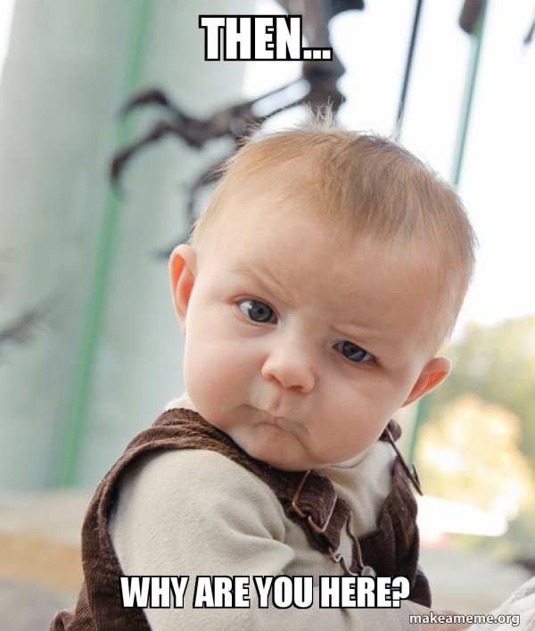
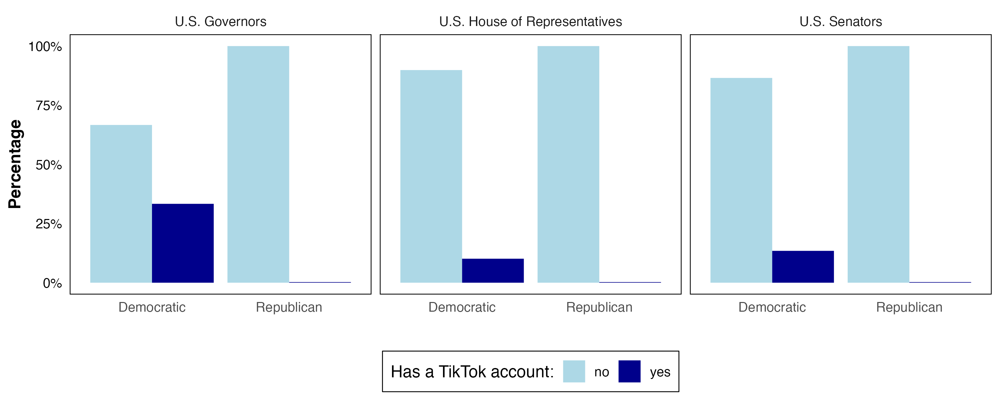
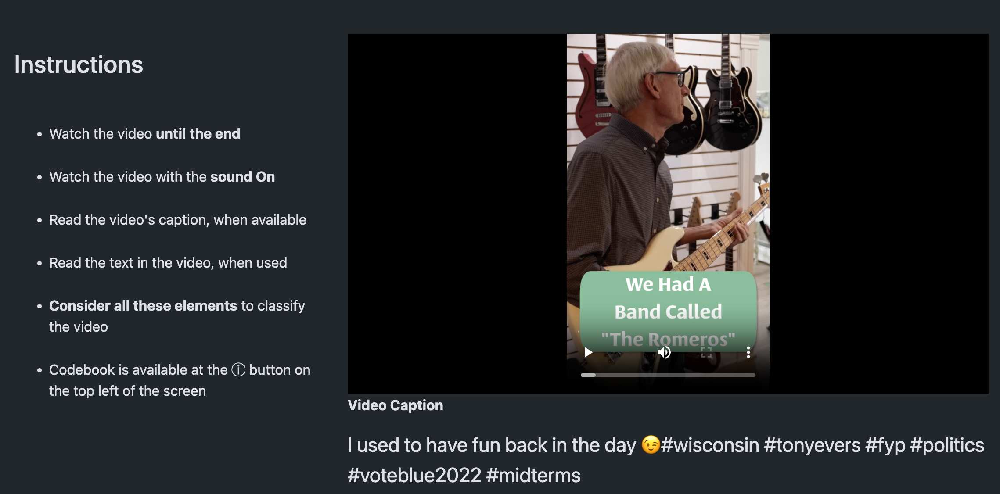
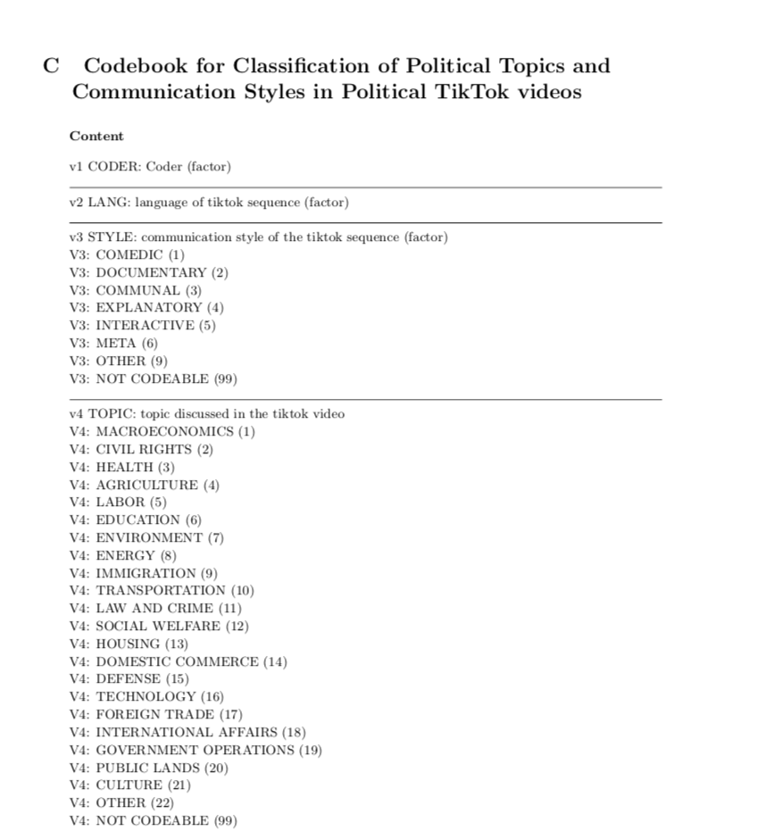

layout: true

<style>
.onehundredtwenty {
  font-size: 120%;
   }

<style>
.ninety {
  font-size: 90%;
   }

.eightyfive {
  font-size: 85%;
   }
   
.eighty {
  font-size: 80%;
   }
   
.seventyfive {
  font-size: 75%;
   }
   
.seventy {
  font-size: 70%;
   }
   
.fifty {
  font-size: 50%;
   }
   
.forty {
  font-size: 40%;
   }
</style>


```{r meta, echo=FALSE, warning = F, message=F}
library(metathis)
meta() %>%
  meta_general(
    description = "TikTok",
    generator = "xaringan and remark.js"
  ) %>%
  meta_name("github-repo" = "nataliaumansky/xxx") %>%
  meta_social(
    title = "TikTok",
    url = "nataliaumansky.github.io",
    og_type = "website",
    og_author = "Natalia Umansky",
    twitter_card_type = "summary_large_image",
    twitter_creator = "@NataliaUmansky"
  )
```

```{r setup, include=FALSE}
# dateWritten <- format(as.Date('2020-05-04'), format="%B %d %Y")
workshop_day <- format(as.Date("2024-09-28"), format="%B %d %Y")
pacman::p_load(tidyverse, fontawesome, tidyverse, knitr)

options(
    htmltools.dir.version = FALSE,
    knitr.table.format = "html",
    knitr.kable.NA = ""
)
knitr::opts_chunk$set(
    warning = FALSE,
    message = FALSE,
    fig.path = "figs/",
    fig.width = 7.252,
    fig.height = 4,
    comment = "#>",
    fig.retina = 3 # Better figure resolution
)
# Enables the ability to show all slides in a tile overview by pressing "o"
xaringanExtra::use_tile_view()
xaringanExtra::use_panelset()
xaringanExtra::use_clipboard()
# xaringanExtra::use_share_again()
# xaringanExtra::style_share_again(share_buttons = "all")
xaringanExtra::use_extra_styles(
  hover_code_line = TRUE,
  mute_unhighlighted_code = FALSE
)
# xaringanExtra::use_webcam()


knitr::opts_chunk$set(warning = F, message = F) # Whether to display errors
```


---
name: title-slide
class: primary


#.fira[`r rmarkdown::metadata$title`] 

###.fancy[`r rmarkdown::metadata$subtitle`]


<br>


Natalia Umansky <br> .small[University of Zurich]

[`r fa(name = "twitter", fill = "black")` @NataliaUmansky](http://twitter.com/NataliaUmansky)<br>
[`r fa(name = "github", fill = "black")` @NataliaUmansky](http://github.com/NataliaUmansky)<br>
[`r fa(name = "link", fill = "black")` nataliaumansky.github.io](http://nataliaumansky.github.io)


`r workshop_day`

.fifty[Link to slides: [nataliaumansky.github.io/data_wrangling_1](https://nataliaumansky.github.io/data_wrangling_1)]

---

### Your Instructor

.leftcol40[


]

.rightcol60[
+ Currently working outside academia

+ Postdoc at the DigDem Lab (University of Zurich)

+ PhD from Connected_Politics Lab (University College Dublin)

+ Passionate about Digital Communication and Data Science

+ Addicted to social media and overusing memes in my slides `r fa(name = "face-grimace")`

+ Love spending time with Mila `r fa(name = "dog", fill = "black")`

]

--

.leftcol40[


]

---

class: secondary

## But enough about me

### Let's dive in! 

---

## .fancy[Schedule]

|When?                           | What?                              | 
|:-------------------------------|-----------------------------------:|
|10:00 - 10:30                   |Introduction & motivations          |
|10:30 - 10:45                   |Coffee break                        |
|10:45 - 12:15                   |Theory                              |
|12:15 - 13:15                   |Lunch                               |
|13:15 - 14:45                   |Manual approach                     |
|14:45 - 15:00                   |Coffee break                        |
|15:00 - 16:30                   |Sampling and ethics                 |

---

.hero[### Let's start from the beginning]


```{r, echo = F, out.width="45%", fig.align = 'center'}

```


---

# Before we begin

## Workshop files

Please download the workshop slides 

https://github.com/NataliaUmansky + / + TikTok

use: https://download-directory.github.io/ to download the entire folder

---
#Workshop structure:

Day 1 (today): Theory

Day 2 (5 Oct): Automatic content analysis

Day 3 (7 Dec): Individual project presentation

---
#Individual Project

You will have to:

- Identify a research question of interest

- Choose an analysis strategy (manual or automatic)

- Collect a sample dataset

- Present your results (7 Dec) in a 10 min individual presentation, including:
  - Reasoning behind your research question
  - Expanation of your empirical strategy
  - Preliminary results
  - Lessons learnt
---
class: coffee

---

##Social Media as a Communication Medium

**Social Media Revolution**: Platforms like TikTok, Instagram, and Snapchat have transformed how people communicate globally, moving from text-based interaction to multimedia content.

- Boyd & Ellison (2007): Social media platforms are defined by their ability to facilitate social interaction and content sharing through various forms of media.
  
- Papacharissi (2015): Social media fosters personalized, participatory communication, *reshaping how information is shared*.
  
---

##The Shift to Multimodal Communication

**Multimodality in Social Media**: Communication on platforms like TikTok involves multiple modes—video, audio, text, and interaction.

- Schellewald (2021): Identifies key communicative styles on TikTok, such as *comedic, documentary, and explanatory*, which engage audiences beyond text alone.

- Abidin (2021): Platforms like TikTok popularize micro-video content that allows users to communicate quickly and effectively, blending visuals, text, and sound. They enable users to *convey emotions and narratives* through audio-visual content, creating a more immersive experience.

---

##Emotional and Visual Cues in Engagement

**Engagement Beyond Words**: Emotional and visual storytelling is key to audience interaction on social media.

- Hayes et al. (2016): *Emotional cues* (such as humor or personal stories) are crucial for driving engagement, with *likes, shares, and comments* acting as indicators of emotional resonance. Moreover, interactive features (comments, likes, and duets) *encourage more meaningful engagement*.

- Kelm (2020): The use of memes, videos, and filters **enhances interaction** by engaging users through humor and creativity, rather than relying solely on textual content.

- Zhang (2021): Reusing popular sounds or music can create a shared cultural experience, making content more relatable and engaging
---

##The Role of Algorithms and Platform-Specific Features

**Algorithms Shape Content Visibility**: Social media algorithms, especially on platforms like TikTok, curate content based on engagement with multimedia elements, not just text.

- Stokel-Walker (2020): TikTok’s algorithm prioritizes content with high visual and auditory engagement, making *video and audio* central to reaching larger audiences.

- Guinaudeau et al. (2022): Viral content often stems from the platform’s ability to deliver personalized content through multimodal interaction, showing the importance of analyzing *more than just text*.

---

##The Future of Social Media Analysis

**Multimodal Analysis is Critical**: To fully understand social media communication, we must analyze the interaction of visuals, audio, and text.

- Freelon (2018): Argues for the need to develop new methodologies that capture the *complexity of social media data*, including multimedia and algorithmic content curation.

- Hautea et al. (2021): Suggests that analyzing *personal narratives and affective connections* in multimodal formats is key to understanding how users engage with content emotionally.

---


### Summary

- **The Evolving Landscape of Communication**: Social media has transformed how we communicate. It's not just about what we say—it's about **how we say it**.

- **Text-Only Isn’t Enough**: Focusing solely on text ignores the full spectrum of communication happening through **visuals, audio, and interaction** on platforms like TikTok, Instagram, and Snapchat.

- **More Than Words**: Platforms like TikTok and Instagram thrive on a combination of video, music, and visual effects. These elements **grab attention and create deeper emotional connections** than text alone.

- **A New Language of Interaction**: Short videos, soundtracks, and even filters have become part of how we communicate online. They create a richer, more engaging experience than text can on its own.

---

### Summary

- **Beyond the Written Word**: Effective communication on social media often relies on **visual storytelling, humor, and personal narratives** to engage audiences.

- **The Power of Video**: **Fun, relatable content** — especially videos that are entertaining or inspiring—tends to get **more likes, shares, and comments**. These elements tap into emotion and authenticity in ways that pure text cannot.

- **Context is Everything**: Simply analyzing text misses out on the emotional and creative layers that drive engagement. We need to look at visuals, sounds, and interactions to truly understand social media communication.

- **Multimodal Communication**: As social media evolves, understanding the entire multimedia ecosystem — video, audio, images, and text — is essential for effective communication analysis.

---
class: lunch
---

##Example

Umansky, N., & Pipal, C. (2023). Dances, Duets, and Debates: Analysing political communication and viewer engagement on TikTok. OSF Preprints. September, 21.

---

##How do US politicians use TikTok?

```{r, echo = F, out.width="85%", fig.align = 'center'}

```

N = 2230 videos

---
### (Manual) Analysis

```{r, echo = F, out.width="70%", fig.align = 'center'}

```


---

#Codebook

```{r, echo = F, out.width="70%", fig.align = 'center'}

```
---
#Questions:

1. What do you find interesting about this approach?

2. What other questions could be answered with this method?

3. What would you change? Why?

---

class: coffee

---
#How to Sample TikTok Data
---
#How to Sample TikTok Data

**Define Your Research Goals**: Before sampling, determine the scope of your study (e.g., analyzing trends, engagement, content types, etc.).

**Data Points to Collect**:

- Video Metadata: Number of views, likes, shares, and comments.
- User Information: Username, followers, and bio (if available).
- Content Type: Videos, captions, hashtags, and audio used.

**Sampling Methods**:

- Random Sampling: Collect a random set of videos based on hashtags, user accounts, or trending topics.
- Stratified Sampling: Focus on particular categories or trends, such as specific challenges, soundtracks, or time periods.
---

#TikTok Data Collection Strategies

**Hashtag-Based Sampling**: Collect data from videos tagged with specific hashtags relevant to your research.

**User-Based Sampling**: Focus on specific TikTok influencers, creators, or user groups.

**Trending Topic Sampling**: Capture videos from the “For You” page, identifying content driven by TikTok's algorithm.

---

###R Packages for TikTok Data Collection

**rtweet**: Primarily designed for Twitter, but can be adapted for TikTok-like structured queries.

  Example use case: Using this package as inspiration for handling API requests and structuring large datasets.
  
---

###R Packages for TikTok Data Collection
**socialmedia**: An R package designed to collect data across multiple social media platforms, including TikTok, Instagram, and Facebook.

**Features**:

- Hashtag-based data scraping.
- Collection of video metadata (e.g., view counts, captions).
- Profile scraping for user engagement patterns.

```{r, eval=FALSE}
library(socialmedia)
tiktok_data <- collect_socialmedia(platform = "tiktok", 
                                   query = "#challenge", 
                                   n = 100)
```

**Challenges**:
API Restrictions: TikTok’s API is limited, making direct data collection harder in R.
Potential Workarounds: Use web scraping techniques with R packages like rvest for basic TikTok page scraping.
---

###Python Packages for TikTok Data Collection

**TikTokApi**: The most widely used package for TikTok data collection in Python.
  
**Features**: 
- Retrieve data by hashtag, username, or trending content.
- Collect video URLs, descriptions, views, likes, and comment counts.
- Pull audio metadata used in videos.
  
```{python, eval=F}
from TikTokApi import TikTokApi
api = TikTokApi()
trending_videos = api.trending(count=10)
for video in trending_videos:
    print(video['desc'], video['stats']['diggCount'])
```

**Limitations**: Legal Concerns: Scraping TikTok’s data can potentially violate their terms of service. Always ensure your scraping methods are compliant.
---
#Ethical Concerns in TikTok Data Collection

**Privacy Concerns**:
TikTok users often create content without expecting to be part of academic research. Ensuring user privacy is crucial.

**Public vs. Private**: TikTok profiles and videos are generally public, but this does not automatically imply consent for research use.

**Recommendation**: Avoid collecting personally identifiable information (PII), such as private messages or sensitive content. This is particularly difficult with TikTok, given that users tend tto display themselves on screen.

**Informed Consent**:
Users are typically unaware that their public posts might be used in research. It's challenging to obtain consent on a large scale for publicly available data.
Consider methods to anonymize data or obtain ethical approval for your research.
---

#Platform Terms and Legal Considerations

**Compliance with TikTok’s API and Terms of Service**:
Always check TikTok’s terms before scraping or using API data to avoid legal issues.

**Key Point**: Some scraping techniques might violate TikTok's policies, leading to potential bans or legal consequences.

**Respect for Platform Guidelines**:
Be transparent with how data is used, especially when publishing findings that could identify users or reveal sensitive information.

---

#Ethical Best Practices in Social Media Research

**Data Anonymization**:
Remove usernames and other identifiers when presenting findings, unless the data is already public and consented for reuse.

**Data Storage & Protection**:
Safeguard the collected data to prevent misuse or unauthorized access.
Follow institutional and national guidelines on data storage and protection.

**Metrics**: While analyzing engagement metrics (likes, shares, etc.), consider how these metrics can reveal personal behavior patterns. Take steps to prevent overexposing individual user activity.

---

<center>

.font200[.fancy[Thank you!]

<br>

And see you on 5 October `r fa(name = "face-smile-wink")`]

</center>